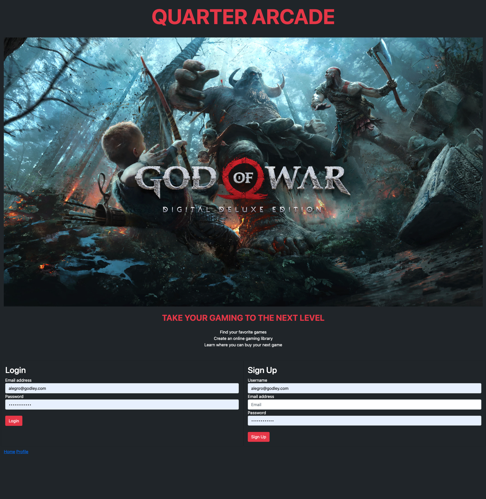

# Project 2 Quarter Arcade

## Table of Contents
- [Description](#description)
- [Technologies Used](#technologiesused)
- [Installation](#installation)
- [Usage](#usage)
- [Credits](#credits)
- [License](#license)

## Description
Welcome to Quarter Arcade! This is a full-stack application that lets you search for games that you are interested in so you can purchase them from a retailer. We wanted to make a website that makes it easier to learn about games a user may be interested in since there are thousands of games and it can be difficult to find something to play. Some things we learned how to do were deploy an application to heroku, retrieve data through GET and POST routes, and use MYSQL for the database.

## Technologies Used
HTML  
CSS  
Javascript  
Heroku  
Node.js  
Express.js  
Handlebars.js  
MySQL  

## Installation
To install this program, clone this repo to your device  
Open the .env file and type your username and password for the variable DB_USER and DB_PASSWORD  
Open your command line within the repo and run mysql -u root -p and type in your password  
Run source schema.sql and then exit mysql  
Go to node .\seeds\seed.js  
Type npm i and then npm start to get the application listening on localhost  
In the browser url type localhost:3001  
## Usage
Create an account under the sign up section or log in if you already have an account. Type in the name of a game to display a banner along with the release date, platforms, and maturity rating.

## Credits
John Grant:https://github.com/jgrant928 
Austin Stamps: https://github.com/AKstamps 
Zain Khawaja: https://github.com/ZainKhawaja98 
Shawn Thomas: https://github.com/LightintheBulb 
Alegro Godley: https://github.com/Galegro2022 

## License
© John Grant, Austin Stamps, Zain Khawaja, Shawn Thomas, Alegro Godley, University at North Carolina Chapel Hill Coding Bootcamp
MIT License
Copyright (c) 2023
Permission is hereby granted, free of charge, to any person obtaining a copy of this software and associated documentation files (the "Software"), to deal in the Software without restriction, including without limitation the rights to use, copy, modify, merge, publish, distribute, sublicense, and/or sell copies of the Software, and to permit persons to whom the Software is furnished to do so, subject to the following conditions:
The above copyright notice and this permission notice shall be included in all copies or substantial portions of the Software.
THE SOFTWARE IS PROVIDED "AS IS", WITHOUT WARRANTY OF ANY KIND, EXPRESS OR IMPLIED, INCLUDING BUT NOT LIMITED TO THE WARRANTIES OF MERCHANTABILITY, FITNESS FOR A PARTICULAR PURPOSE AND NONINFRINGEMENT. IN NO EVENT SHALL THE AUTHORS OR COPYRIGHT HOLDERS BE LIABLE FOR ANY CLAIM, DAMAGES OR OTHER LIABILITY, WHETHER IN AN ACTION OF CONTRACT, TORT OR OTHERWISE, ARISING FROM, OUT OF OR IN CONNECTION WITH THE SOFTWARE OR THE USE OR OTHER DEALINGS IN THE SOFTWARE.